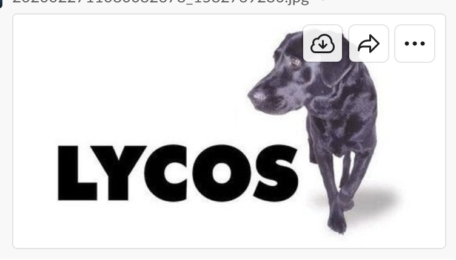
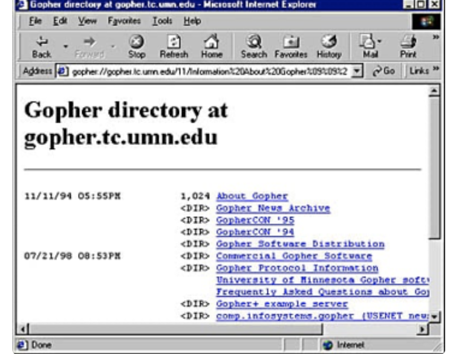
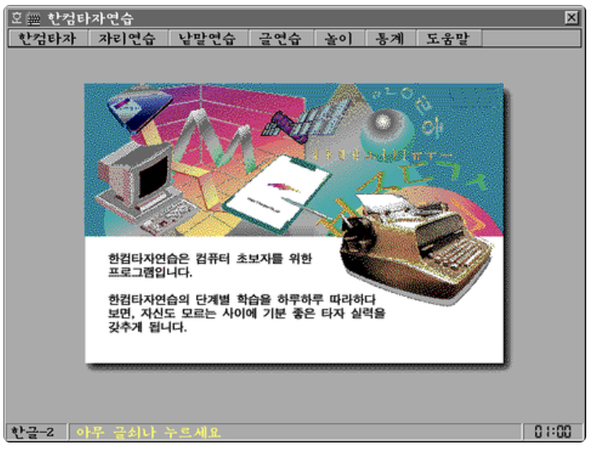

# 23그룹 릴레이 프로젝트 첫번째 과제

# 라이코스

https://www.lycos.kr/1. 어떤 서비스?
 \- 검색 엔진 및 포털 사이트2. 어느 회사에서?
 \- 1994년 카네기 멜런 대학교 연구실에서 개발
 \- 1995년 인터넷 투자기업 CMGI가 라이코스를 기업으로 만듬3. 어떤 고객에게 무엇이 도움되는지?
 \- 웹 문서 검색 엔진으로 시작
 \- 인물 검색
 \- 이메일
 \- 쇼핑몰
 \- 뉴스 제공4. 기타
 \- 야후, 다음과 함께 3대 포털사이트(였음)
 \- "잘했어 라이코스"라는 광고 문구로 인상깊게 남음
 \- 광고로 수익을 내는 포털사이트

# 고퍼 프로토콜

고퍼 프로토콜미네소타 대학교에서 개발함1990년대 초중반 PC 환경이 아직 CUI 기반이었을 때 많이 사용되었다. 개발 시기는 1990년으로 월드와이드 웹과 거의 유사. (웹은 1991년에 개발되었다.)텍스트 기반의 터미널 인터페이스에 맞춰져 있으며 웹보다 더 강력한 분류 시스템의 지원이 특징
키보드 방향키를 사용하여 각 메뉴에 포커스되는 커서를 이동시킨 뒤 엔터 키를 눌러 원하는 메뉴에 들어가는 방식으로, MS-DOS 시절 많이 쓰였던 MDir을 연상하면 쉽다. 번호나 명령어를 눌러 바로 메뉴로 이동할 수도 있었다. PC 통신 의 인터페이스와 유사한 점이 꽤 많았다.웹 브라우저와 유사하게 고퍼 브라우저를 사용해서 들어갈 수 있으며, 도스나 윈도우를 비롯한 여러 플랫폼으로 클라이언트가 출시됨. HTML처럼 복잡한 렌더링 엔진이 필요하지 않기 때문에 별의별 플랫폼으로 클라이언트가 있다.

# 아이러브 스쿨

인터넷에서 학교 동문을 찾아주는 사이트로 초등학교에서 대학교까지 옛 추억을 함께 했던 학교 친구와 선후배를 찾아주는 서비스.

단순히 친구를 찾는 것에 그치지 않고 회원들로부터 [장학금](https://namu.wiki/w/장학금)을 적립해 모교에 기증하는 등 좋은 일도 하고 회원간 유대도 강화함.

아이러브스쿨은 1999년 10월 정식 서비스를 시작한 이래 국내 커뮤니티사이트 가운데 최단 기간 500만 명 회원을 보유하는 기록을 세움.

하지만, ‘나 그때 너 좋아했는데’하는 게다가 잦은 경영진 교체, 불화로 시장에 안착한 후 막 성장해야 할 시기에 서비스가 휘청댐.

또한, 때늦은 고백으로부터 시작된 온갖 불륜에 이르기까지 오프에서 크고 작은 사고들이 끊이지 않았다.

# 싸이월드

싸이월드 서비스 1999년에 서비스 시작
본격적인 실명제 미니홈피**서비스**라는 블로그형 **서비스**를 제공
2000년대에 국내 소셜 네트워크 서비스의 절대적인 강자로 남았다.

# 버디버디

지금의 카카오톡같은 pc로 하는 메신저입니다.	2020년 1월 처음 서비스를 시작한 온라인 메시저로 쪽지 전송, 대화창을 통한 상대와 채팅, 음성/화상 채팅, 아바타 시스템, 미니홈피 시스템 등의 소셜 네트워크 서비스 기능이 제공되어 당시의 청소년들에게 선풍적인 인기를 끌었던 대표적인 메신저 입니다. 경쟁사인 네이트온에 의해 점점 이용자가 감소, 스마트폰의 보급화로 인해 (카카오톡), 서비스 종료되었습니다.

# 윈도우 라이브 메신져

윈도우 라이브 메신저
윈도우의 기본 인스턴트 메신저 서비스
MSN 메신저로 출발하여 2005년에 Windows Live Messenger로 개명
원격 지원, 웹 메신저 서비스, 플러그인 등 여러 기능이 있었음
지인을 위장한 사기 행위가 종종 있었음
윈도우 XP에 기본 설치되어서 흥행했으나 이후 국내 메신저의 출시로 쇠락
결국 2013년에 스카이프와 통합

# 고구마언덕

고구마언덕
김풍작가가 관리한 웹페이지로 커뮤니티 이지만 자신의 글을 올리면서 사람들과 소통하였고
다른 커뮤니티 사이트와 달리 개인이 관리하여 자유분방했으며 관리도 잘했고
만화와 게임같은 컨텐츠를 지속적으로 올려주었지만
김풍작가가 관리할자신이 없어서 폐지했다고합니다

# 당나귀

어떤서비스?
개인간 파일을 공유하는 p2p서비스
P2P(Peer to Peer) 서비스란 인터넷 상의 정보를 검색엔진을 거쳐 찾아야 하는 기존 방식과 달리 인터넷에 연결된 모든 개인 컴퓨터로부터 직접 정보를 제공받고 검색은 물론 Download 까지 할 수 있는 서비스이다.
좋았던점 불편했던점
다양한 파일을 쉽게 다운 받을 수 있어서 좋았지만 낚시 파일과 불법 파일도 많았으며 다운로드 속도 또한 빠르지 않았다.

# 프루나

- P2P 사이트(파일 공유 프로그램)
- 불편했던 점
- 사용자가 원하지 않아도 자동공유 설정이 되어 있어서 내 컴퓨터를 자원으로 사용한다.
- 바이러스 감염 위험
- 불법 공유
- P2P 기반 파일 공유 프로그램인 eMule에 기반을 두어 만들어진 클론으로 최초에는 미디어뱀프라는 이름으로 불렸다가 이후 프루나로 이름을 바꾸고 2005년 회원제로 전환하였다.

# 한컴타자연습

- 한컴타자연습

1997년도에 배포 시작(최초의 한컴타자연습 프로그램이자 도스 기반으로 작성된 유일한 버전이다.)
[한글과컴퓨터](https://namu.wiki/w/한글과컴퓨터)의 [한컴오피스](https://namu.wiki/w/한글과컴퓨터 한컴오피스) 제품을 구입할 때 제공되는 [타자연습](https://namu.wiki/w/타자연습) 소프트웨어다

# 알타비스타

알타비스타라는 검색엔진은 Digital Equipment Corporation (DEC)이라는 회사에서 만든 것 입니다.
DEC은 Alpha 프로세서를 개발한 회사였고 90년대 초반까지 중대형 컴퓨팅 시장의 강자였습니다. Alpha 프로세서의 우수한 성능을 보여주기 위해 만든 시험 프로젝트였습니다.당시에 웹크롤링을 통해 수많은 HTML을 수집하고 이를 분류하고 키워드를 추출하여 지금의 검색엔진과 같은 역할을 수행한다는 것은 획기적인 시도였습니다.당시 멀티쓰레드를 지원하는 'Scooter(스쿠터)'라는 검색 로봇(크롤러)과 자사의 Alpha 프로세서를 채택한 대형 유닉스머신으로 전세계 웹사이트를 돌아다니며 수집을 시작했고, 지금은 대세가 된 64비트 프로세싱을 당시 Alpha 프로세서는 지원하고 있었다.1998년 알타비스타는 야후의 검색엔진으로 채택되지만, 여러 회사에 매각되면서 사라지게 되었습니다.